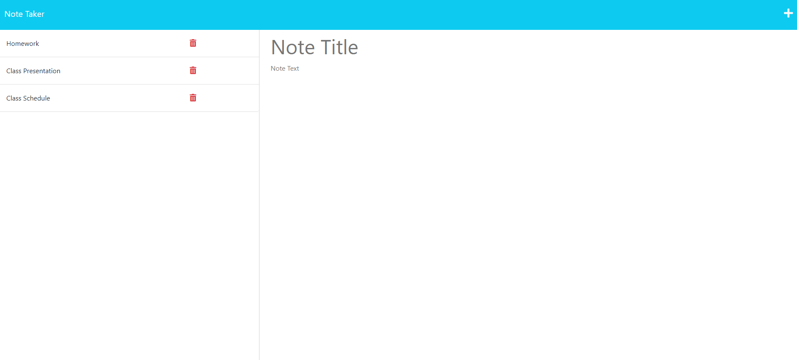

# note-taker-id

## Description

This application allows the user to create detailed notes with titles and descriptions. If the user wants to keep the note, the user can save the note using the save button. If the user wants to delete a note, the user can delete the note by using the delete button.

## Installation

The user can run npm start into their terminal to pull up the application on local host.

## Usage

You can try out the note taker application through the link provided here: https://note-taker-id.herokuapp.com/

## Credits 

Rutgers Bootcamp, Professor Joe Han, TA Paul Cwik, Classmates Eric Kirberger, Jonathan Plaras, and Azime Nail.

## License

MIT License ,, Please refer to the GitHub repo
